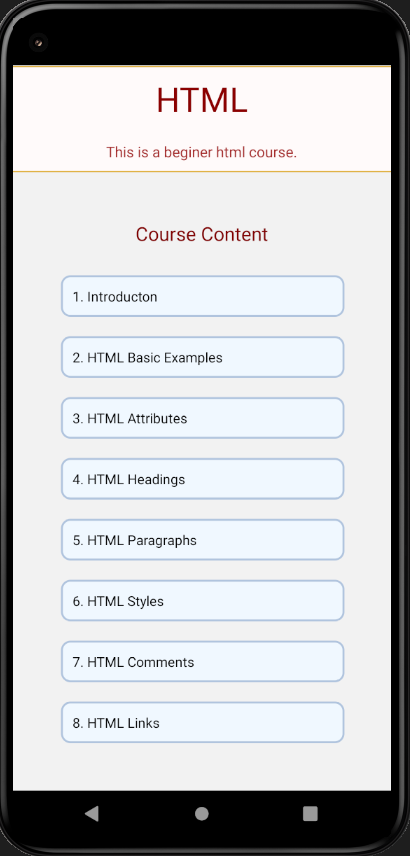

# Mini Project 2 : Student Helper

Project partner: Sayyed ali

Student Helper isn't just a project. It's an Emotion...

Student Helper an E - Learning app created for computer science students to enhance their skills.

We created some components like: 

1. QNA : stands for Questions and answers. where students get a variety of different questions and answers according to their category.

2. Webinars : Students will be updated with new webinars conducted by the college or an organization in the form of videos.

3. Blogs : Students will be updated with new blogs published by other students and Also they can write their own blog.

4. Aptitude : 

Section 1: Here they can attempt quiz to improve their logics and there is no limit to practise.

Section 2: Here they can attempt contest which usually conducted once a week. (We are working on it to improve)

5. DSA : 

Section 1: Here some DSA Questions are available.

Section 2: Here they can attempt contest which usually conducted once a week. (We are working on it to improve)

6. Courses : They can get variety of courses here like html , css , js etc.

7. Jobs : We have added a job section using Rapid API's

8. Chatbot : Student can solve their queries using chatbot.

# Snapshots

  
  
  

  
  
  

  
  
  

  
  
  

  
  
  

  
  
  

